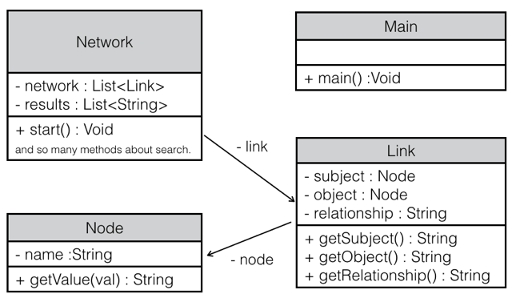

プログラミング演習 第一回
=====================
学籍番号 : 1029-23-8484  
氏名 : 伊藤勝梧  
Mail : s.ito@ai.soc.i.kyoto-u.ac.jp

## 1 プログラムの説明
### 1.1 概要
知識表現手法（推論システム）の一つである，意味ネットワーク（セマンティックネットワーク）を実装した。

このプログラムでは、リンクを作成してネットワークを作ることや、ネットワーク内を検索することができる。一般的な意味ネットワークでは"is-a"、"has-a"という関係を使うことが一般的であるが、今回のプログラムではその制限は設けず、"likes"のような関係も扱うことができる。

### 1.2 クラス
以下のクラス図にあるように、Node、Link、Network、Mainの4つのクラスを作成した。  
Nodeクラスは意味ネットワークにおけるノードを意味し、その名前を表すnameをメンバ変数にもつクラスである。  
Linkクラスは「主語(Subject)ノード」と「述語(Object)ノード」とその２つの関係を示す「関係(Relationship)」をメンバ変数に持つクラスである。  
Networkクラスはリンクの集合であるnetworkというメンバ変数を持つクラスである。    
Mainクラスはプログラムを動かすときに使用され、mainメソッドを呼び出すことで、Networkのstartメソッドが呼び出され、プログラムが動き出す。  

クラス図のNetworkクラス部分のメソッドについては、検索に関するメソッドが多く存在するため、紙面の都合上割愛した。

### 1.3 外部仕様
 Mainクラスを実行することで、プログラムを起動できるが、それ以降は標準入力を用いて、ネットワークへの新しいリンク作成や検索を行うことができる。
 標準入力にて使用するコマンドは「1.4 機能」の項で説明する。
 
### 1.4 機能
実装した機能を以下で紹介する。
#### セットアップ

    setUp

このコマンドでは以下の様なネットワークが生成される:  
[S.Jobs]--[is-a]--[Former_Apple_CEO]  
[S.Jobs]--[likes]--[The_Beatles]  
[S.Jobs]--[is-a]--[Apple's_Founder]  
[Apple's_Founder]--[is-a]--[Genius]  
[S.Wozniak]--[is-a]--[Apple's_Founder]  
[S.Wozniak]--[has-a]--[Doctor_of_Science]  

#### ネットワークの表示

    show
    
このコマンドでは現在のネットワークの状況を表示することができる。
出力はそれぞれのリンクが一行ずつ表示される。

#### リンクの作成

    S.Jobs is-a Apple's_Founder
    
例えば、上のような入力をすると[S.Jobs]--[is-a]--[Apple's_Founder]というリンクが作成される。
[Subject]--[Relationship]--[Object]は`S R O`のようにしてスペースで区切って入力をする。  
リンクの作成が成功すると`Seccess!`という結果が返ってくる。

#### "what"検索

    ?x likes The_Beatles
    
例えば、上のような入力は英語で"Who likes The Beatles"という意味を表し、`?x`に該当する`S.Jobs`という結果が返ってくる。
知りたい部分を`?x`にすることで結果を得ることができる。

#### 真偽検索

    S.Ballmer is-a Apple's_Founder?

例えば、上のような入力は`False`という結果が返ってくる。入力の一番最後に`?`をつけることで、その文が正しいかどうかを判断する検索をすることができる。

#### AND/OR検索

    ?x is-a Apple's_Founder AND ?x likes The_Beatles

例えば、上のような入力では`S.Jobs`という結果が返ってくる。前半の`?x is-a Apple's_Founder`という質問と`?x likes The_Beatles`という質問の共通解を出力する。前半の質問では`S.Jobs AND S.Wozniak`が解となり、後半の質問では`S.Jobs`が解となるため、全体の解答は`S.Jobs`である。

    S.Jobs is-a Apple's_Founder? OR S.Jobs is-a MicroSoft's_Founder?

上の例のように真偽検索でもAND/OR検索をすることができる。  

ANDとORで質問をいくつも繋げることもできる。
ただし、本来ANDとORはANDが優先されるべきであるが、今回の実装では左から順番に評価していくという実装になっているので、注意されたい。  

#### 深い検索
現状のネットワークの中には  
[S.Wozniak]--[is-a]--[Apple's_Founder]と  
[Apple's_Founder]--[is-a]--[Genius]  
の2つのリンクが存在するが、その時

    S.Wozniak is-a ?x

この入力の結果は `Apple's_Founder AND Genius`となる。

また、

    S.Wozniak is-a Genius?

というような真偽検索でもリンクをたどって検索をすることができる。

検索の範囲は同じ関係(Relationship)でつながっているリンクのみであり、例えば[A]--[is-a]--[B]、[B]--[likes]--[C]のような場合にはAからCにはたどり着くことはできない。

#### 終了

    end
   
このコマンドにより、このプログラムを終了させることができる。

## 2 実行例
コマンドには[$]、出力結果には[>]、コメントには[#]をつけて実行例を簡単に解説する。
	
	# セットアップ
	$ setUp
	
	# セットアップによってできたネットワークを確認
	$ show
	> S.Jobs : is-a : Former_Apple_CEO
	> S.Jobs : likes : The_Beatles
	> S.Jobs : is-a : Apple's_Founder
	> Apple's_Founder : is-a : Genius
	> S.Wozniak : is-a : Apple's_Founder
	> S.Wozniak : has-a : Doctor_of_Science
	
	# Jobsは狂っていることを追加(リンク作成)
	$ S.Jobs is-a crazy_man
	> Success!
	
	# 誰がAppleの創始者なのか検索("what"検索)
	$ ?x is-a Apple's_Founder
	> S.Jobs AND S.Wozniak
	
	# JackはAppleの創始者かどうか検索(真偽検索)
	$ Jack is-a Apple's_Founder?
	> False
	
	# JobsはAppleとMicroSoftの創始者かどうか検索(AND検索)
	$ S.Jobs is-a Apple's_Founder? AND S.Jobs is-a MicroSoft's_Founder?
	> False
	
	# Appleの創始者でビートルズが好きな人は誰か検索(AND真偽検索)
	$ ?x is-a Apple's_Founder AND ?x likes The_Beatles
	> S.Jobs
	
	# Jobsは天才かどうか検索(深い検索)
	$ S.Jobs is-a Genius?
	> True
	
	# 終了
	$ end
	

## 3 テスト
今回作成したプログラムでは標準入出力を用いているが、JUnitを使ったテストから標準入出力を扱うためにはそれ専用のクラスを定義しなければならず、煩雑であったため、テスト向けのI/OインターフェイスをNetworkクラス内に定義した。  
本来、テストのためのコードは書くべきではないが、今回はプログラムのアルゴリズムを変更せずにI/Oだけを変更するという条件の下でテスト用のコードを追加した。  

テストコードはNetworkTest.javaを参照して頂きたい。  
「1.4 機能」の項で説明した機能はすべてテストに含まれるようになっている。

テストケースの作成に関しては、`True`、`False`が解となるような2つの質問を用意したり、検索結果が複数になるような質問を用意したりするように心掛けた。

## 4 考察
普段はWebアプリケーションの開発でオブジェクト指向言語のRubyを使っているが、Web開発においてはそこまでオブジェクト指向開発を気にしてはいないので、今回はそれを強く意識して開発をするという経験をすることができた。  
メンバ関数の持ち方に関する理解が低く、アドバイザーの方に指摘されて修正することができて勉強になった。

Javaに関しては、メソッドはできるだけprivateにしておかなければならないことや、publicにした場合にはJavaDocの説明を書かなければいけないことや、メンバ変数を関数内で用いる際には`this.`を付けなければならないことなどを学ぶことができた。これらのことは知らなくてもプログラムは動いてしまうので、今回アドバイザーの方から教えて頂けたのは良い経験だったと思った。  

課題には明示的に書かれていなかった「真偽検索」や「深い検索」の機能を実装できたのは満足だが、真偽検索においてANDとORの優先順位をAND>ORに出来なかったのは少し残念であった。  
ショートカットの`show`コマンドを入力した時に、リンクを一行一行出力するのではなくて、ネットワークがひと目で分かるような出力ができると意味ネットワークを操作している雰囲気が出て、面白さが増すだろうと思った。